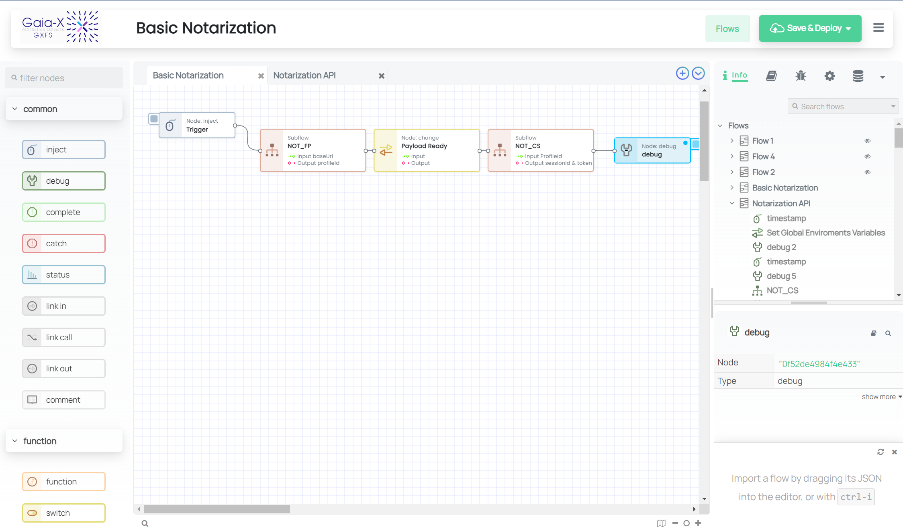

# GXFS Workflow Engine (WFE)

An improved Low-code workflow engine for event-driven applications with added enhancements and features optimized for GXFS.

# About

GXFS Workflow Engine is a fork of the popular node-red project, with additional features aimed at improving application networking. The project takes the core functionality of node-red and extends it, making it easier to create complex networked applications and services. GXFS WFE is designed to implement and configure onboarding and Accreditation workflows for the Gaia-X ecosystem and runs under Apache Version 2 license.

## Key Features

- Enhanced user interface for easier navigation/integration
- GUI Generator with JSON Data
- Expanded connectivity through the implementation of specialized nodes for external interactions
- Better integration with cloud services for seamless deployment
- Advanced application networking capabilities
- Improved performance and reliability

The GXFS Workflow Engine is an ongoing development effort and some of its key features are still in progress. Keep checking our project page for updates and new releases.

## Quick Start

If you want to run the latest code from git, here's how to get started:

1. Clone the code:

        git clone https://gitlab.com/gaia-x/data-infrastructure-federation-services/GXFS_OAW/workflow-engine-wfe/gxfs-workflow-engine/gxfs-wfe.git
        cd gxfs-wfe

2. Install the node-red dependencies

        npm install

3. Build the code

        npm run build

4. Run

        npm start
		
5. Launch URL
		
	<http://localhost:1880>

## Getting Help

Please note that the GXFS Workflow Engine project will have continuous updates and improvements to its documentation.

## Copyright and license

GXFS Workflow Engine is released under [the Apache 2.0 license](LICENSE).
