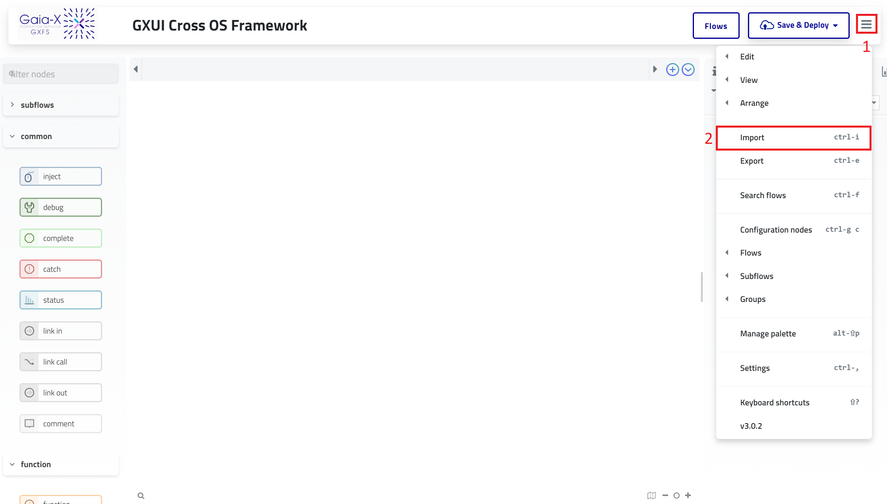
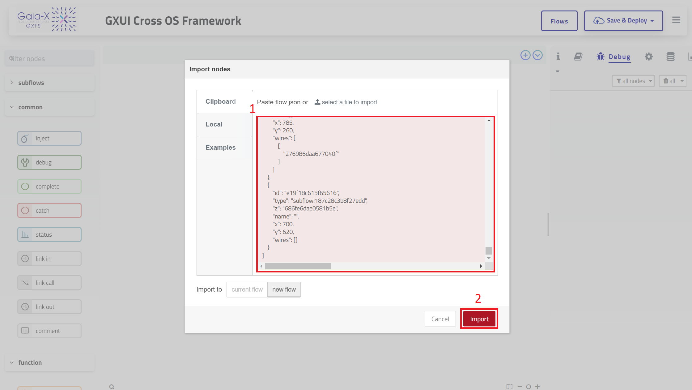
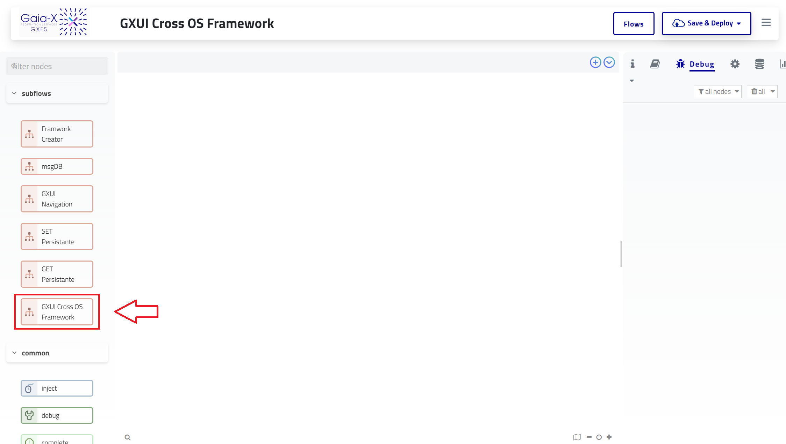
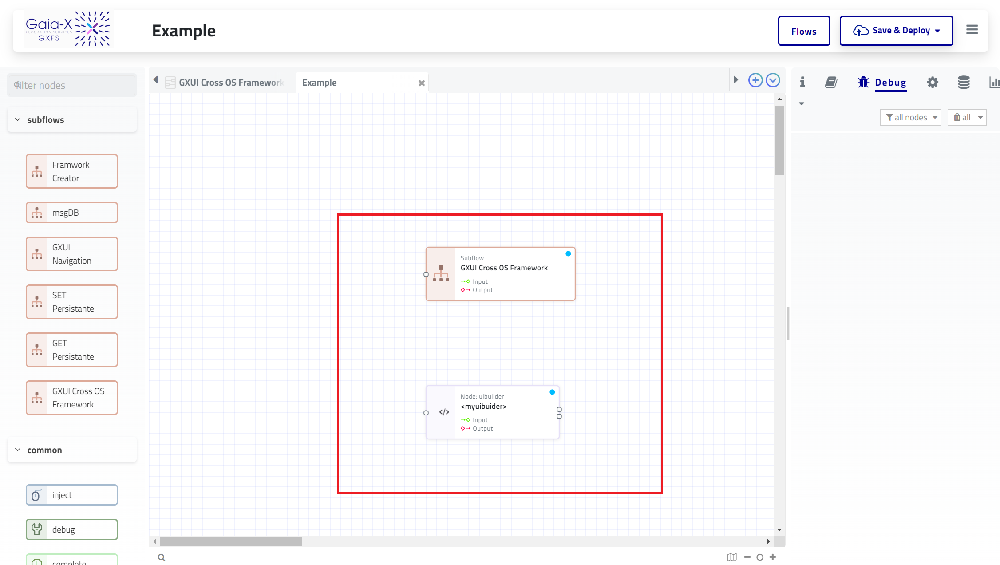
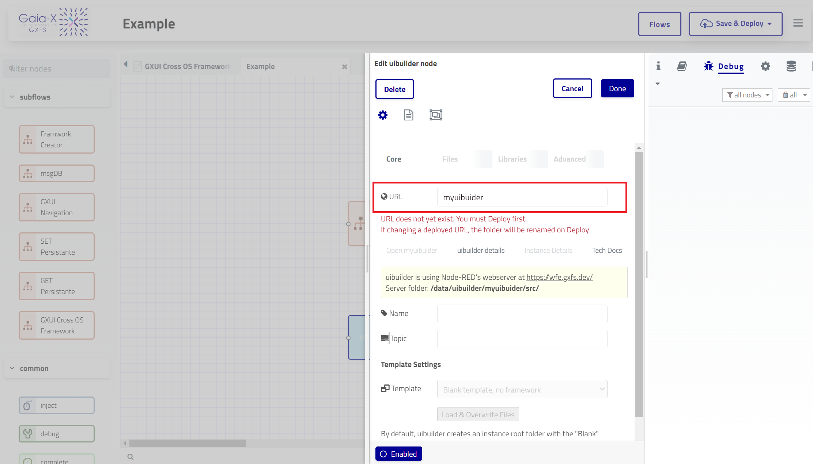
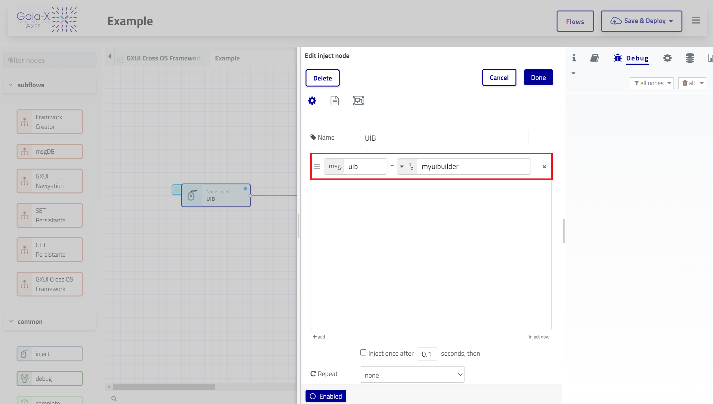
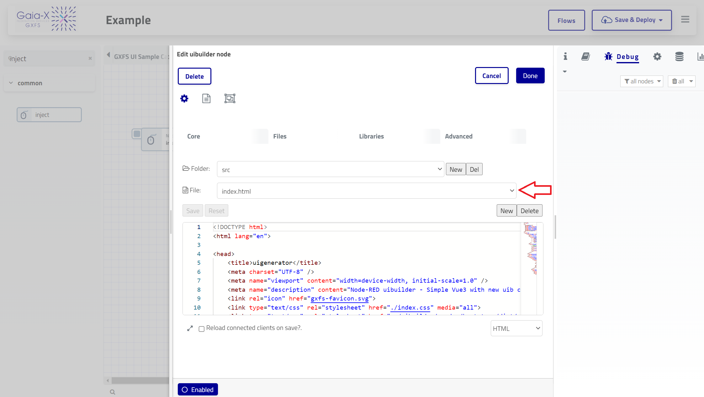

# GXUI Cross OS Framework

# Introduction

Welcome to the GXUI Cross OS Framework for Node-RED! This node streamlines the setup process for your UI Builder by automatically populating the required files (index.html, index.js, and index.css)within the UIBuilder's directory. As a result, your UIBuilder will be ready to use in no time.

# Prerequisites

**Step One** :
Install and run the Gaia-X Workflow Engine by following the instructions in the linked repository.

**Step Two** :
Install node-red-contrib-uibuilder:

      npm install -g node-red-contrib-uibuilder

# Installation
To get started with the GXUI Cross OS Framework, follow these steps:

In Node-RED, go to the settings menu and choose "Import."

Import the JSON file and save it.

Once the JSON file is imported successfully, you will find the subflow in the left-side palette.

# Usage Guide

Once you've imported the subflow, follow these steps to utilize the GXUI Cross OS Framework:

1. Locate the imported subflow in the left-side palette.
2. Drag and drop the subflow onto the workspace, along with a UIBuilder node . connect a inject node to the subflow.

3. Choose a URL for the UIBuilder.(for example we choose myuibuilder as a url)

4. Double click on the GXUI Cross OS Framework node then In the Inject node, set the msg.uib field to the chosen UIBuilder URL and deploy your flow.

5. Click on the inject . After completing these steps, the necessary files (index.html, index.js, and index.css)will be successfully imported into the UIBuilder's directory.

